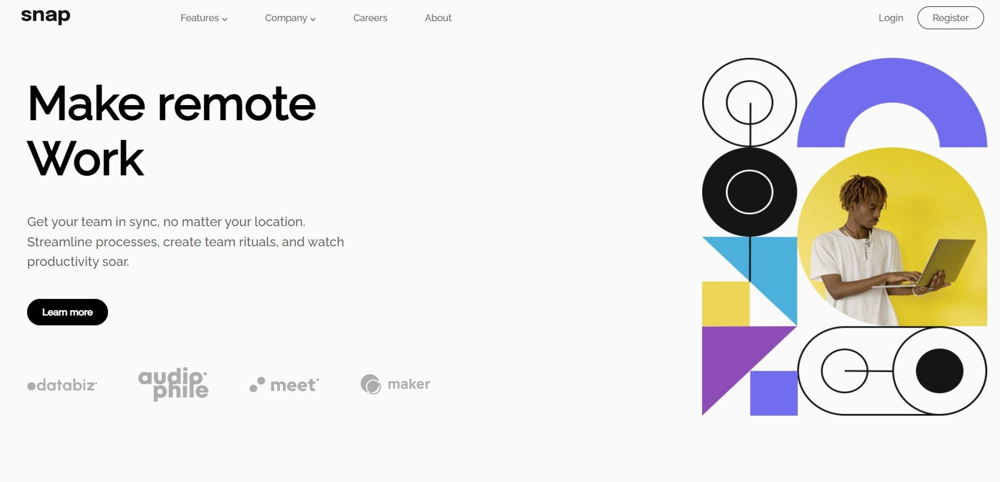
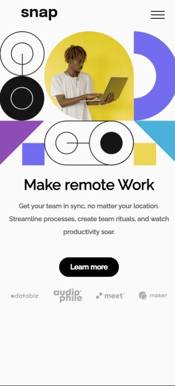

## Screenshot

## Links

Solution URL: [Add solution URL here](https://github.com/brahimbouargane/landing_page)  
Live Site URL: [Add live site URL here](https://landing-pagebihi.netlify.app/)

## Build with

- HTML5
- CSS3
- Flexbox
- JavaScript

## What I learned

I should see the work from above first then I have to work on.

## Continued development

I want to focus a lot in the basics of any language then i will move on.

### Useful resources

I have two resources

- [Example resource 1](google.com)
- [Example resource 2](youtube.com)

## Author

- Frontend Mentor - [@yourusername](https://www.frontendmentor.io/profile/brahimU20)
